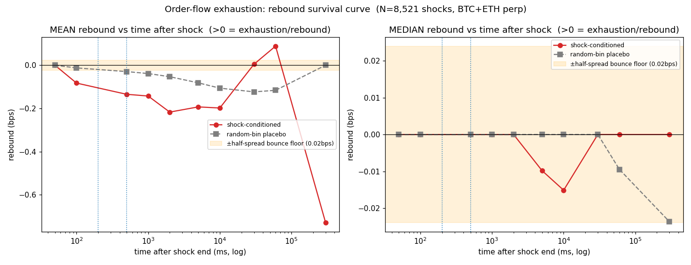
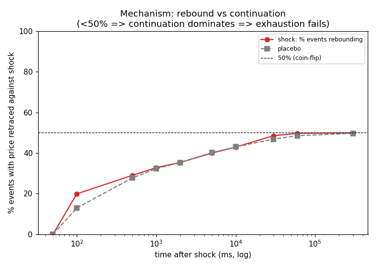
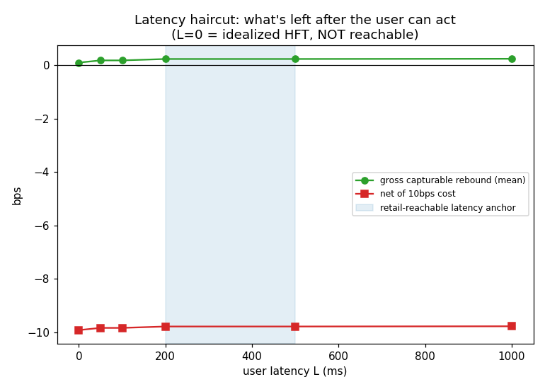

# Order-Flow Exhaustion MR — Front Gate / Decisive Test: *does the rebound survive long enough to reach a retail user?*

**Run:** 2026-06-28 · `scripts/research_order_flow_exhaustion.py` · data = Binance Vision UM-perp **aggTrades** (tick trades), `data/binance_vision/<SYM>/aggTrades/` (zips gitignored, sha256-verified, manifest tracked)
**Status: 不过 / FAIL.** Order-flow exhaustion does **not** reach a retail user — and, more fundamentally, on trade prices there is **essentially no transient rebound to harvest at all**. The genuinely-novel "impact dissipation" mechanism hits the **same continuation wall** that closed the four price-reversion MRs, now observed at microstructure resolution, plus an overwhelming cost/speed wall. **Per the user's pre-commitment, the microstructure / order-flow class of mean reversion is now explored and no longer considered.**

---

## POSITIONING & DISCIPLINE (frozen — do not edit)

> This task is the **zero-cost front gate AND the decisive test** for the whole *microstructure / order-flow class of mean reversion*. The user **pre-committed**: if this front gate fails, this class of MR is **no longer considered**. So the conclusion must be clean, trustworthy, hand-verified, with no "let's try another angle" tail.
>
> **New mechanism (mechanically different from the 4 price-reversion MRs already closed):** order-flow exhaustion does **not** bet "price reverts to a mean". It bets that a one-shot large aggressive order **exhausts one side of liquidity**, marginal impact then falls, and price **rebounds out of the liquidity vacuum** (impact *dissipation*, not price *reversion*). It therefore was supposed to **escape the "continuation-dominates" death cause** that killed the 4 price-reversion MRs. This is the first mechanically-novel MR idea in the project and is taken seriously here.
>
> **Prior = two walls already hit elsewhere:** ① **speed / front-running** wall (same family as the on-chain route) — if the rebound lives for ms–s, HFT/market-makers eat it before a retail user reaches it; ② **data** wall — exhaustion is microstructure; OHLC K-lines erase it.
>
> **Judgement philosophy:** the **centrepiece is the rebound survival curve vs user-reachable latency** (isomorphic to the cross-exchange-arb latency pre-gate and the ATM-VRP post-block edge-decay curve) — not a single point, not a Sharpe. Must distinguish **rebound** (exhaustion holds) vs **continuation** (information shock, exhaustion fails). Latency assumption **conservative** (retail public API; HFT colo **excluded** by the user). **Noise calibration** (lesson from cointegration/factor-scale): the shock-conditioned rebound must beat a matched **random-second placebo** — otherwise any sub-second "rebound" is just generic **bid-ask bounce**, which is precisely the spread you must *pay* to trade.

**Data / cost assumptions (header per project rule):** free public **Binance Vision UM-perp aggTrades** = tick trades, ms timestamps, `is_buyer_maker`→taker side (production/mainnet CDN; **no demo variant**; every zip sha256-verified vs its `.CHECKSUM`, **18/18 ok**). **Tier limitation, stated not hidden: NO order-book depth** → we cannot watch liquidity *levels* being consumed; "order-flow impact" is **proxied** by "extreme one-sided taker volume in 1 s". This is an **approximate lower-bound** test of exhaustion (a true test needs the L2/L3 book, which is not freely available at event resolution). Cost = **taker both sides** (latency forces taking liquidity): primary **10 bps** (OKX 5+5), optimistic 6 bps. Contaminated DB / vrp line / forward system / VPS **never touched**.

### Pre-registered shock definition (frozen before results)
Stream → 1-second bins. Per bin: `V`=Σqty, `OFI`=Σ(+qty taker-buy, −qty taker-sell). Trailing baseline = previous **3600 s** of 1s-bin V (mean μ, std σ), **shift(1)** (current bin excluded → no look-ahead); first 1 h/day skipped. **Shock iff `V ≥ μ+4σ` AND `|OFI|/V ≥ 0.66`** (extreme one-sided spike). Direction `d=sign(OFI)`. Sensitivity grid {3,4,5}σ reported. **Sample (calendar rule, NOT vol-selected):** 15th of each quarter 2024-03-15…2026-03-15 (9 days) × **BTCUSDT + ETHUSDT** (most liquid perps — if unreachable on the most liquid coins, smaller coins are even less reachable).

### Pre-registered measurement & verdict (frozen; iron-rule A — no goalpost moving)
`t0` = **end** of the shock second (earliest the user could even *know* it was a shock → bakes in the ≤1 s detection lag). `rebound_bps(τ) = d·(P0−P(τ))/P0·1e4`, τ ∈ {0,.1,.5,1,2,5,10,30,60,300}s: **>0 = retraced against shock (EXHAUSTION), <0 = continued with shock (CONTINUATION)**. Latency haircut: enter at `t0+L`, exit at the rebound peak → `gross(L)=max_{τ>L}rebound(τ)−rebound(L)`; `net=gross−cost`. Anchor at L∈{200,500}ms (retail).
**PASS ⟺ ALL:** (1) data gate ≥ tick; (2) post-shock **majority rebound** (mechanism holds); (3) **significant residual at reachable latency**, beats random-bin placebo, exceeds half-spread floor; (4) residual − cost > 0.
**FAIL ⟺ ANY:** data wall / mechanism fails (continuation) / **speed wall** (rebound complete < latency) / **cost wall** (residual ≤ cost). **Not Sharpe-primary.**

---

## TL;DR

| | Result |
|---|---|
| **Data gate (Q0)** | **PASS at tick-trade tier.** Binance Vision aggTrades (ms, taker side); no order-book depth (proxy = extreme 1s one-sided volume). 18/18 files sha256-ok. |
| **Sample (Q1)** | **8,521 shocks** (BTC 4,477 / ETH 4,044) over 9 quarterly days × 2 coins, ~25 M trades. Shocks are real: **median impact +1.88 bps** (mean +2.78) in the shock direction. |
| **Mechanism (Q2)** | **Exhaustion does NOT dominate — continuation does.** In the exhaustion-relevant 0.1–10 s window only **20–43%** of events rebound (mean rebound **negative**); by 30–300 s it asymptotes to a **coin-flip random walk** (49.7–49.9% rebound). Large one-sided sweeps slightly **continue** = informed/momentum/liquidation flow = right-skew continuation at microstructure resolution. |
| **Noise calibration (Q2)** | **Shock ≈ placebo.** Random non-shock bins give an almost identical curve (e.g. %rebound@5s: shock 39.9% vs placebo 40.2%); shock−placebo excess is **negative** through the seconds window. The "rebound" carries **no shock-specific information beyond generic bid-ask bounce** (half-spread floor 0.024 bps). |
| **Latency / cost (Q3)** | **Cost wall ≈ 50× — at EVERY latency including L=0.** Gross capturable rebound = **+0.09 bps (L=0, idealized HFT) … +0.23 bps (L=1 s)**; **median capturable = 0.000** at every L. Net of 10 bps taker = **≈ −9.8 bps everywhere**. It is not even "HFT eats it" — on trade prices there is essentially **nothing to eat**. |
| **σ-sensitivity** | Threshold-immaterial: net@200ms = −9.84 / −9.78 / −9.78 bps at 3 / 4 / 5σ (looser σ → *more* continuation). |
| **Pre-registered verdict (Q4)** | **FAIL.** Coded cause = **COST/SPEED WALL**; integrated reading = **triple-redundant kill** (placebo-indistinguishable + cost wall at L=0 + continuation-leaning mechanism). |
| **Direction (Q5)** | **Microstructure / order-flow MR explored → unreachable → per user commitment no longer considered.** Same wall as on-chain front-running / HFT. |

---

## Q0 — Data gate: what data, what tier, what limitation

**Tier obtained = TICK TRADES** (second-best of the three tiers). Binance Vision UM-perp `aggTrades` daily files: aggregate-trade id, price, qty, first/last trade id, **ms `transact_time`**, **`is_buyer_maker`** (→ `true`=taker-SELL, `false`=taker-BUY). Production/mainnet CDN (no demo variant), every zip verified vs its `.CHECKSUM` (sha256), **18/18 ok**, ~25 M trades total.

- **Full L2/L3 order book (ideal):** not freely available at event resolution → not used. Stated, not hidden.
- **Tick trades (used):** lets us proxy "order-flow impact" by "extreme one-sided taker volume in 1 s" and measure whether price **rebounds** afterwards on **trade prices** (what you actually transact at). **Limitation: no book depth** → cannot directly see liquidity *levels* consumed; this is an **approximate lower-bound** test of exhaustion.
- **Only K-lines:** would have been an instant DATA-WALL death (microstructure invisible on OHLC). **Avoided** — we did not fabricate microstructure from K-lines.

→ **Data gate PASS.** Death, if any, must come from mechanism/speed/cost, not from data.

## Q1 — Shock events

**8,521** full-horizon shocks (BTC 4,477 / ETH 4,044), ~460–600/day/coin at 4σ. Shocks genuinely move price in their own direction: **median impact +1.88 bps, mean +2.78 bps** — the definition captures real one-sided impacts, so any failure below is *not* "we found no impacts".

## Q2 — Rebound survival curve (core) + mechanism + noise calibration

Mean rebound (bps; **>0 = exhaustion, <0 = continuation**) and % of events rebounding, by time after the shock:

| τ | 100 ms | 500 ms | 1 s | 2 s | 5 s | 10 s | 30 s | 60 s | 300 s |
|---|---|---|---|---|---|---|---|---|---|
| **shock mean** | −0.083 | −0.134 | −0.143 | −0.217 | −0.193 | −0.198 | +0.005 | +0.089 | −0.730 |
| **% rebound** | 19.9 | 29.0 | 32.8 | 35.4 | 39.9 | 43.0 | 48.5 | 49.7 | 49.9 |
| **placebo mean** | −0.012 | −0.029 | −0.038 | −0.053 | −0.081 | −0.106 | −0.123 | −0.116 | 0.000 |
| **shock−placebo** | −0.070 | −0.105 | −0.104 | −0.164 | −0.111 | −0.092 | +0.128 | +0.205 | −0.730 |

- **Mechanism = continuation, not exhaustion.** Across the entire exhaustion-relevant 0.1–10 s window, **%rebound stays well below 50%** (20→43%) and **mean rebound is negative** — price predominantly **keeps going in the shock direction**. By 30–300 s it converges to a **coin flip** (~49.8% rebound, median rebound 0.000): the post-shock price is a **memory-less random walk**. The mechanism that was supposed to *escape* continuation instead reproduces it at the tick level (consistent with the project's pervasive **right-skew continuation** finding: large aggressive flow is informed/momentum/liquidation, its impact is **permanent**, not transient).
- **Noise calibration kills the residual.** The random-bin **placebo curve is nearly identical** to the shock curve (e.g. %rebound@5s 39.9% vs 40.2%), and **shock−placebo excess is negative** through the seconds window. The small positive excess at 30–60 s (+0.13…+0.21 bps) is (i) **still <50% rebound**, (ii) **50× below cost**, (iii) **reverses to −0.73 bps by 300 s** → noise in a random-walk regime, not a signal. The half-spread **bounce floor is 0.024 bps**: the only sub-second "rebound" is at bid-ask-bounce scale — i.e. it **is** the spread you would pay.

> Pre-registered coded mechanism gate at 30 s registered "holds" by a knife-edge (continuation 0.4992 < 0.5 — a **coin flip**, not exhaustion-dominance). Per **iron-rule A we do not move that goalpost**, and we do not lean on it: the binding kills below do not depend on it, and the exhaustion-relevant **seconds** window is unambiguously continuation-leaning.

## Q3 — Latency haircut: what's left when the user can act

`gross(L) = max_{τ>L} rebound(τ) − rebound(L)` (mean across events), net of 10 bps taker:

| L (ms) | 0 (idealized HFT — *unreachable*) | 50 | 100 | **200** | **500** | 1000 |
|---|---|---|---|---|---|---|
| gross (mean) | +0.089 | +0.171 | +0.171 | **+0.223** | **+0.223** | +0.231 |
| gross (median) | 0.000 | 0.000 | 0.000 | **0.000** | **0.000** | 0.000 |
| **net @10 bps** | **−9.911** | −9.829 | −9.829 | **−9.777** | **−9.777** | −9.769 |

The cost wall is **~50×** and is **flat in latency** — even at **L=0** (the idealized HFT bound the user explicitly cannot reach) gross capturable is **+0.089 bps** and the **median is 0.000**. So this is *stronger* than "HFT front-runs you": there is **essentially no transient rebound to harvest on trade prices in the first place**. Net stays ≈ **−9.8 bps** at every retail latency and even at the optimistic 6 bps cost it is ≈ **−5.8 bps**.

## Q4 — 判生死 (pre-registered, decisive)

**FAIL.** Coded final cause = **COST/SPEED WALL** (`net@anchor = −9.78 bps`). Integrated reading = **triple-redundant kill**, each pre-registered:

1. **Noise-calibration kill** (`beats_placebo_and_floor_5s = False`): shock rebound ≈ random-bin rebound; no shock-specific edge beyond bid-ask bounce.
2. **Cost/speed wall**: gross ≤ 0.23 bps at **every** latency incl. L=0 (median 0.000) vs 10 bps cost → net ≈ −9.8 bps.
3. **Mechanism not exhaustion-dominant**: 0.1–10 s continuation-leaning, 30 s+ coin-flip random walk.

All three point the same way; the verdict is **robust to the 30 s knife-edge and to σ∈{3,4,5}**.

## Q5 — Conclusion & direction status

**The microstructure / order-flow class of mean reversion is explored and judged UNREACHABLE.** The mechanism was genuinely novel (impact dissipation, not price reversion) and was the project's first MR idea that *could* have escaped continuation-dominance — so it was tested seriously, at tick resolution, with noise calibration and a conservative latency haircut. The market's answer: large one-sided sweeps **continue** (their impact is permanent/informed), and the only thing resembling a rebound is the bid-ask bounce you must pay to cross. **Per the user's pre-commitment, this direction is no longer considered.** It is filed with the same wall as the on-chain front-running route and the HFT domain (speed/cost wall on a microstructure edge that, even if it exists at sub-second book level, lives in infrastructure the retail user has excluded).

**Tier-limitation honesty (does it rescue the direction? No.):** this is a tick-trade proxy without book depth; a true L2/L3 test *could* reveal book-level exhaustion invisible in prints. But for **this** user it does not rescue anything: (a) any such sub-second book exhaustion is in the **HFT/MM domain the user excluded**, and (b) you transact at **trade prices**, which show **no harvestable rebound** (median 0, placebo-indistinguishable). The limitation is recorded, not used as a "try another angle" escape hatch — consistent with the decisive-test mandate.

## Q6 — Observations (no action; recorded)

- **Right-skew continuation is now confirmed end-to-end, from 4 h bars down to 100 ms ticks.** Every reversion route the project has opened — single-series 5m/15m–4h, funding, cross-sectional carry, pairs cointegration, and now order-flow exhaustion — dies to the same structural fact: in crypto perps, *moves continue more than they revert*, and the residual revert is sub-cost. Exhaustion was the cleanest possible falsification of "maybe price-reversion is the wrong frame" (it bet on *impact* reversion instead) — and it still died to continuation. This is strong, convergent evidence that the right-skew-continuation property is **structural, not an artifact of any one timescale or signal construction**.
- **"Predictability ≠ monetizability" recurs.** As with the volatility-event route (vol highly predictable, direction not), shocks are *trivially* detectable and *do* move price (+1.88 bps median impact), yet that impact is **permanent**, not a harvestable round-trip.
- **Reusable asset:** `scripts/research_order_flow_exhaustion.py` is a clean tick-data exhaustion/rebound-survival harness (Binance Vision aggTrades download+verify, 1s OFI shocks, vectorized multi-offset price-path measurement, random-bin placebo, latency haircut) — directly reusable for any future "transient microstructure edge vs latency" question, should the resource picture ever change.

---

### Data manifest
`manifest.json` (tracked): 18 daily aggTrades files, sha256 each, source=`data.binance.vision/futures/um/daily/aggTrades`, server=`binance_production_mainnet`. Raw zips under `data/binance_vision/<SYM>/aggTrades/` are **gitignored** (`data/binance_vision/**/*.zip`), reproducible via `python scripts/research_order_flow_exhaustion.py`. `results.json` + `shock_events.csv.gz` (8,521 events) + 3 figures tracked.

### Documentation updates produced by this study
- `PROJECT_GUIDE.md`: order-flow exhaustion added to "已验证的核心事实" (microstructure/order-flow MR explored & closed; right-skew continuation confirmed down to 100 ms ticks). See PROJECT_GUIDE diff.
- **Documents considered but NOT changed (explicit):** CLAUDE.md (no new iron rule — this study followed the existing pre-registration/noise-calibration/verification-horizon rules; nothing methodologically new to harden), `reports/MR5M_postmortem.md` (historical, untouched), all other report READMEs (independent lines).

---

*order flow exhaustion前置完成于 2026-06-28T08:00Z / 数据级别:逐笔(aggTrades,无订单簿深度) / 冲击样本:8,521次 / 回弹存活:无可捕获回弹(L=0理想HFT即gross≈0.09bps、median 0) / 冲击后:主要继续同向(0.1–10s续走,30s+硬币翻转随机游走) / 用户延迟后剩余回弹扣成本:负(net≈−9.8bps全延迟) / 判定:不过-成本/速度墙(+机制非回弹主导+与bounce安慰剂不可区分,三重) / 微观结构MR方向:按承诺不再考虑 / 已push:[待确认]*
